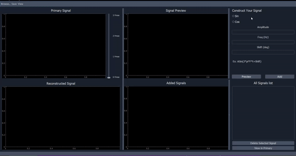

<h1>Nyquist Theorem Illustrator  </h1>

### **DESCRIPTION:**

An illustrator for the signal recovery that shows the importance and validation of the <b>Nyquist Theorem</b>.

<ul>
  <li>User can compose a signal it can be  (sin or cos ) wave 
  also can change its magntiude ,frequancy & phase shift
  & before add signal to added list you can preview your signal.  
 </li>
  <li>The user can reconstruct/recover the signal from the sampled points.</li>
  <li>The user can import/export 
  a signal from   txt , csv file to sample it and reconstruct it again </li>
</ul>

 

## **PREVIEW:**

 
 

## **Team Members**
- Mohamed Bulkheir
- Omar Ansary
- Ahmed Osama 
-  Mohan Elbatran
